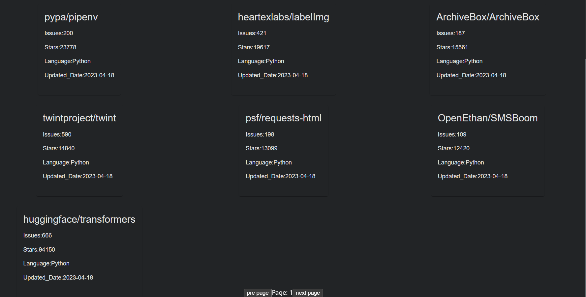
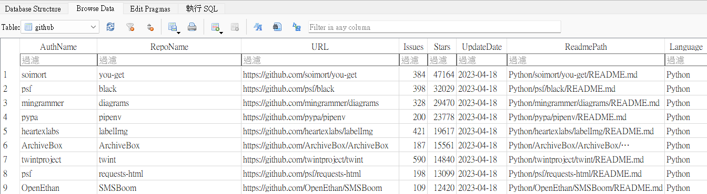

# pygithub-API
使用pygithub來獲取更客製化的github搜尋，並且加上github trending紀錄

## 使用方法
1. ```pip install requirements.txt```
2. 將.env.sample的名稱改為.env,並輸入自己的github api key
3. 在.env檔案中設定自己想要的搜尋條件，然後執行repo_crawler.py，取得符合搜尋條件的專案ID
4. 啟動detail.py取得專案的詳細資料，並將資料存入sqlite
5. 啟動API.py開啟server，在網址列輸入```http://127.0.0.1:8000/repos```即可獲取資料庫裡的資料
6. 提供兩種參數可調整回傳的結果`limit`限制回傳的資料數量`offset`指定從第幾筆資料開始回傳

## 取得github trending
1. 啟動timeTask.py，每隔1天會抓取一次github trending
2. 打開API.py，在網址列輸入`http://127.0.0.1:8000/trendingDaily`

## 未解決問題
1. 增加github trending可以跳轉到不同日期的方法
2. 提供更好的系統設計方法，可以發pr

## Demo
這只是後端，可以自己寫一個前端來呈現畫面，也可以直接使用[這裡](https://github.com/IceTeaOxO/GithubReport)的React模板來Demo。

## UI畫面


## 資料庫資料
